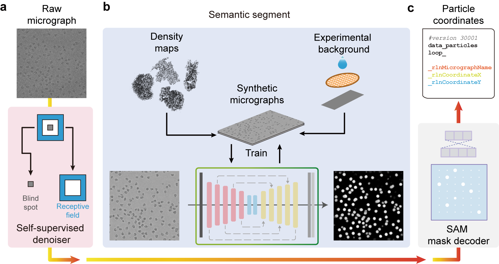

# ParSeek: Automated Particle Picking with Synthetic Data (Work In Progress)

[](LICENSE)
[](https://www.python.org/)

ParSeek is a deep learning-based particle picker for cryo-electron microscopy (cryo-EM), **trained entirely on synthetic data** without any manual annotation. It achieves performance competitive with state-of-the-art annotation-dependent methods and can be seamlessly integrated into standard single-particle analysis (SPA) workflows.

> 📄 **Reference:**
> *ParSeek: Accurate cryo-EM particle picking with a deep learning model trained on synthetic data*
> *Jiaqiang Qian, Yousheng Gong, Fuyan Liu, Yimiao Huang, Gaoxing Guo, Ya Zhu and Qiang Huang*
>  – *Please cite if you use this code.*

---

## ✨ Key Features

- **🔄 Fully Synthetic Training:** Generates realistic training micrographs by projecting known 3D structures into experimental background patches.
- **🎯 High Accuracy:** Achieves precision and recall comparable to leading tools (Topaz, CryoSegNet) on multiple CryoPPP benchmark datasets.
- **🔬 Ready for Production:** Outputs standard STAR files compatible with **RELION** and **cryoSPARC**.
- **🧩 Modular Pipeline:** Includes a self‑supervised denoiser, a U‑Net segmentation network, and a SAM‑based mask‑to‑coordinate converter.
- **📈 Proven in Practice:** Successfully used to determine high‑resolution structures of an antibody–antigen complex and two ligand‑bound GPCRs.

---

## 🚀 Quick Start

### 1. Installation

```bash
# Clone the repository
git clone https://github.com/Fudan-HQLab/ParSeek.git
cd ParSeek

# Create a conda environment (recommended)
conda env create -n parseek python=3.10
conda activate parseek

# Install dependencies via pip
pip install -r requirements.txt
```

### 2. Run ParSeek on Your Micrographs

```bash
# Basic usage
python apps/parseek.py \
    --config /path/to/your/config.json \
```

### 3. Output

- `*_pick.star` – STAR‑format particle coordinates for RELION.
- `particles.star` – STAR‑format coordinates for cryoSPARC.
- `probability_maps/` – Confidence maps for visual inspection (if needed).

---

## 📖 Pipeline Overview

ParSeek follows a four‑step workflow:

1. **Self‑supervised denoising** – Enhances micrograph contrast without external training data.
2. **Semantic segmentation** – U‑Net with gated attention predicts particle probability maps.
3. **Mask generation** – Segment Anything Model (SAM) converts probability maps to binary masks.
4. **Coordinate extraction & filtering** – Outputs standardized particle coordinates with size/IoU filters.



---

## 🧪 Training Your Own Model

To generate synthetic training data and train ParSeek from scratch:

```bash
# Step 1: Generate synthetic micrographs
python scripts/generate_synthetic_micrographs.py \
    --background_dir /path/to/backgrounds \
    --structure_dir /path/to/pdb_emdb_maps \
    --output_dir ./synthetic_data

# Step 2: Train the denoiseing network
python train_denoise.py \
    --config /path/to/your/config.json

# Step 4: Train the segmentation network
python train_seg.py \
    --config /path/to/your/config.json
```

---

## 📁 Repository Structure

```
ParSeek/
├── run_parseek.py              # Main inference script
├── train_seg.py                # Training segmentation script
├── train_denoise.py            # Training denoiser script
├── models/                     # Network architectures
│   ├── base.py
│   ├── denoise.py
│   └── seg.py
├── scripts/                    # Data generation & utilities
│   ├── generate_synthetic_micrographs.py
│   └── evaluate_benchmark.py
├── pretrained_models/          # Pre‑trained weights
├── docs/                       # Documentation & figures
└── requirements.txt            # Pip dependencies
```

---

## 📚 Citation

If you use ParSeek in your research, please cite:

```bibtex
@article{yourpaper2025,
  title={ParSeek: Automated cryo‑EM particle picking with a deep learning model trained on synthetic data},
  author={Jiaqiang Qian, Yousheng Gong, Fuyan Liu, Yimiao Huang, Gaoxing Guo, Ya Zhu and Qiang Huang},
  journal={XXXXXXXX},
  volume={XX},
  pages={XXX--XXX},
  year={2025},
  doi={XXXXXXXXXXX}
}
```

---

## 🤝 Contributing

We welcome issues, feature requests, and pull requests.

---

## 📄 License

This project is licensed under the **Apache License 2.0**.
See [LICENSE](LICENSE) for details.

---

## ❓ FAQ

**Q: Does ParSeek require GPU?**

A: Yes, for training and fast inference. A GPU with ≥8 GB memory is recommended.

**Q: Can I use ParSeek with cryoSPARC/RELION?**

A: Yes, output formats are directly compatible.

**Q: How long does training take?**

A: ~6 hours on a single RTX 4070 Ti Super for the synthetic dataset of 6600 micrographs.


---

